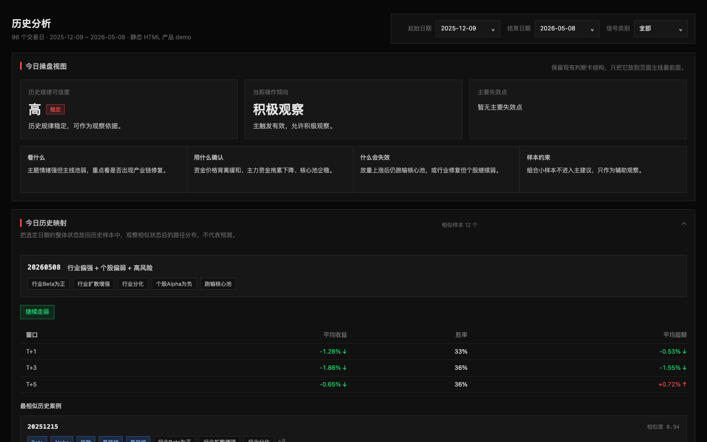

# AnchorLink

锚定联动分析系统 — 锚定一家公司，与板块联动对比分析，自动生成每日复盘报告。

当前标的：铂力特 (688333.SH)

## 预览

<p align="center">
  
</p>

> [在线体验完整 Demo](docs/demo.html) — 暗色主题，信号面板 + 历史分析 + 性格档案 + 时间轴

## 数据管道

### 两链架构

```
A链（行情→评分→日报）: price → dailyreport → history → v2 → daily_report → 二阶 → composite → deep_quant → excess_grade
B链（指数→超额→Q×G→分歧）: custom_indexes → standard_excess_profile → decomposition → qg_profile → benchmark_divergence
汇合: A+B → dashboard_view → 漂移检测 → 自动校准
```

### 运行命令

```bash
# 每日更新（推荐）
uv run python scripts/run_all.py --days 120

# 补历史（新增股票）
uv run python scripts/run_all.py --days 365

# 数据不一致时（B链校验失败提示 anchor 数据不一致）
uv run python scripts/run_all.py --days 120 --force-normalize

# 仅重跑B链
uv run python scripts/run_research_chain.py --force

# 检测B链是否滞后
uv run python scripts/run_research_chain.py --check-only
```

### 参数说明

| 参数 | 用途 |
|------|------|
| `--days 120` | 覆盖窗口，增量补缺不重拉 |
| `--force-normalize` | 同步 normalized 数据后重跑 B 链（数据不一致时用） |
| `--force-research` | 强制重跑 B 链（规则变了但日期没变时用） |
| `--skip-research` | 跳过 B 链 |

### B链输出目录

| 目录 | 内容 |
|------|------|
| `data/price/analytics/index_products/` | 类ETF指数NAV + anchor超额 |
| `data/price/analytics/index_excess_profiles/` | 标准超额画像 + forward labels |
| `data/price/analytics/index_excess_qg_profiles/` | Q×G 网格画像 |
| `data/price/analytics/index_benchmark_divergence/` | 四ETF基准分歧分析 |

每个目录都有 `build_manifest.json`，记录上游 SHA256 和 source_data_as_of。

## 四类股票池

| 股票池 | 回答的问题 |
|--------|-----------|
| 核心同类 `direct_peers` | 业务可比公司今天强不强？ |
| 产业链 `industry_chain` | 上下游有没有同向变化？ |
| 主题情绪 `theme_pool` | 市场是不是在炒主题？ |
| 交易观察 `trading_watchlist` | 短期资金有没有切换？ |

五类 35+ 信号（Beta / Alpha / Volume / Rotation / Abnormal），每个信号带证据链。

## 快速开始

```bash
git clone <repo-url> && cd AnchorLink
cp .env.example .env
# 编辑 .env 填入 TUSHARE_TOKEN
uv sync

# 启动前端
cd web && npm install && npm run dev
# 访问 http://localhost:3000

# 更新数据
uv run python scripts/run_all.py --days 120
```

| Token | 用途 |
|-------|------|
| `TUSHARE_TOKEN` | 股票数据源（https://tushare.citydata.club） |
| `DASHSCOPE_API_KEY` | AI 筛选（可选） |

## 分析报告

`docs/excess_backtest/` 目录包含超额分析报告：

| 文件 | 内容 |
|------|------|
| `excess_grade_thresholds.json` | 超额分档阈值 |
| `excess_grade_daily.csv` | 每日超额分档 |

## 常见问题

**报告显示"数据不足"？** 运行 `uv run python scripts/run_all.py --days 365` 积累历史数据。

**B链提示"anchor数据不一致"？** 使用 `--force-normalize` 同步数据后重跑。

**B链滞后怎么办？** 运行 `uv run python scripts/run_research_chain.py --force` 重跑。

**前端显示数据异常？** 
1. 清缓存：`rm -rf web/.next && npx next dev`
2. 校验数据：`python3 scripts/validate_data.py`

**如何修改股票池？** 编辑 `config/pools.yaml`（更新 version 和 changelog），然后运行 `uv run python scripts/run_all.py`。

**Tushare 超时导致部分数据缺失？** 重新运行即可，系统有增量补缺和超时重试机制。

## 技术栈

Python 3.11+ / Tushare / pandas · Next.js 15 / React 19 / Tailwind CSS

## 文档

| 文档 | 内容 |
|------|------|
| [CLAUDE.md](CLAUDE.md) | Claude Code 操作红线 |
| [产品 Demo](docs/demo.html) | 在线体验完整界面 |
| [产品架构设计](docs/产品架构设计.md) | 八层架构与数据流向 |
| [核心逻辑](docs/核心逻辑.md) | 股票池模型与计算口径 |
| [信号指标设计](docs/信号指标设计.md) | 五类 35+ 信号设计 |
| [数据契约](docs/数据契约.md) | 数据规范与字段映射 |
