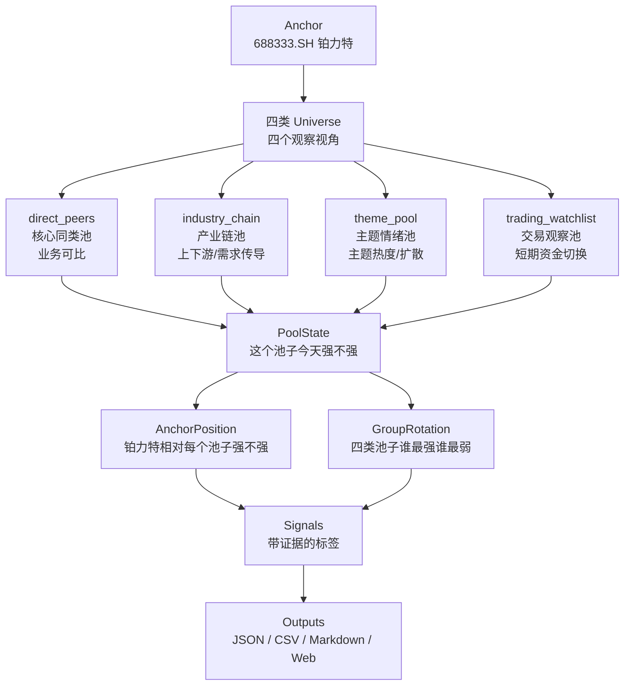
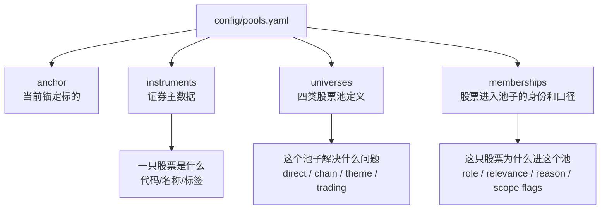
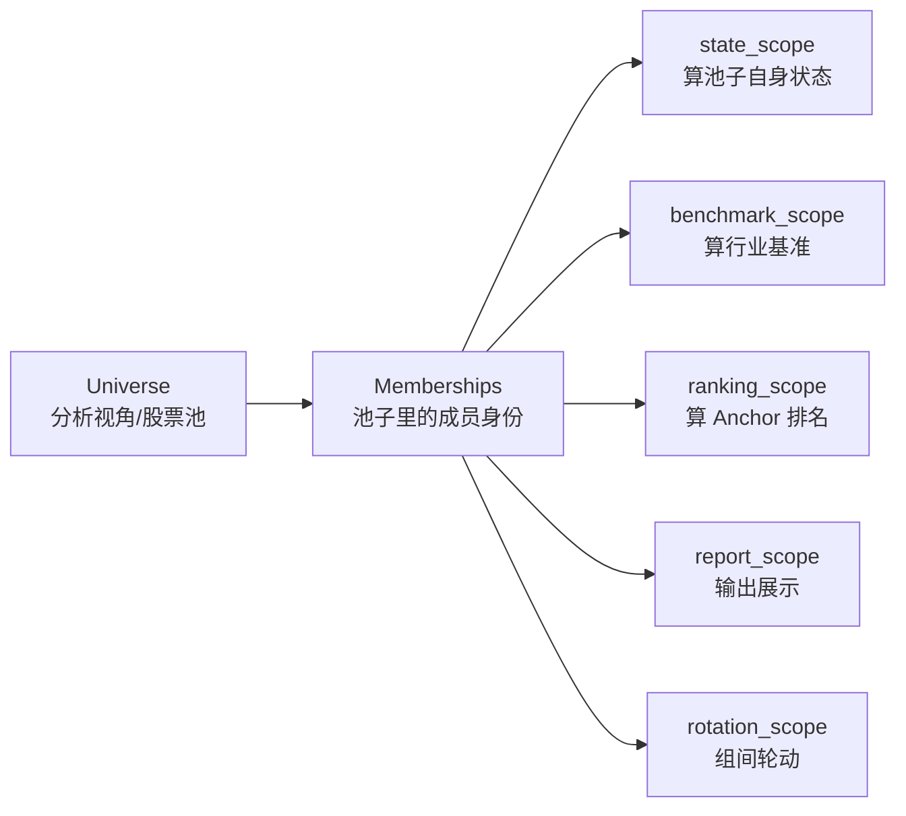
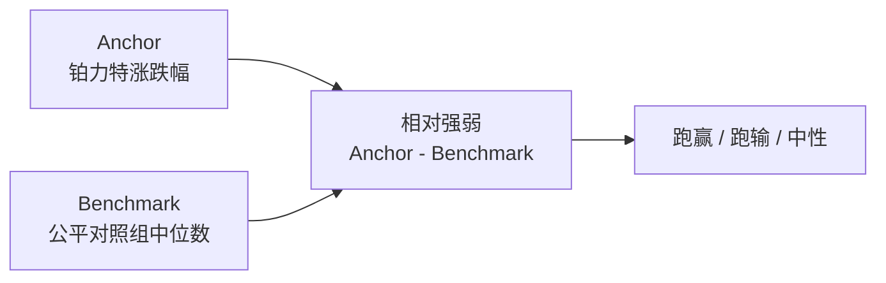
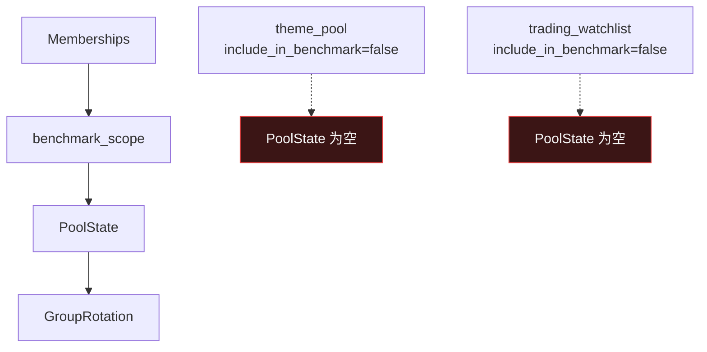
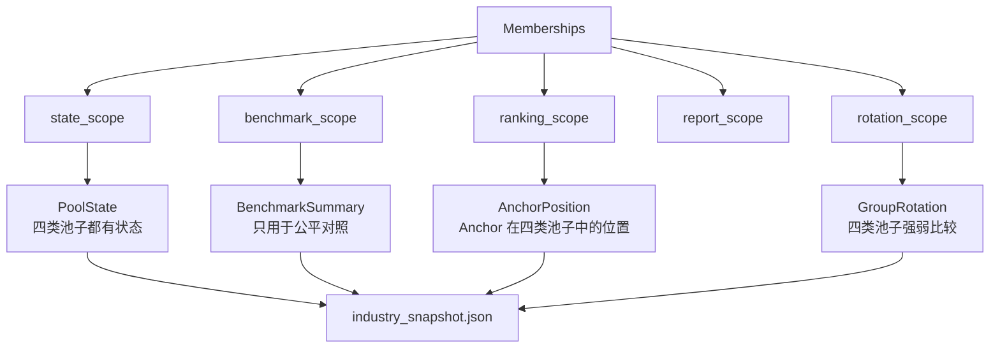
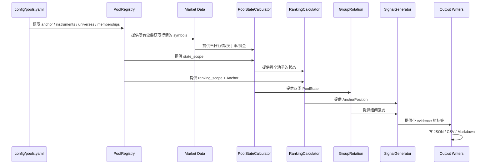
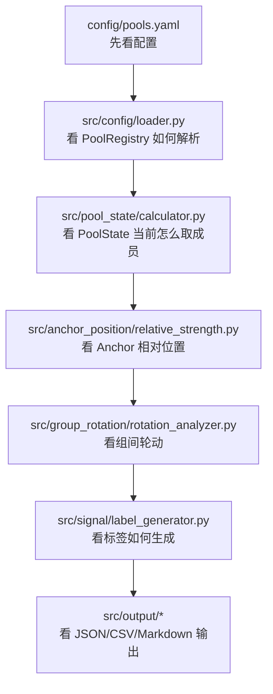

# AnchorLink Universe 可视化理解图

> 用途：用图理解股票池配置、计算口径、当前实现状态和目标方案。
> 配套阅读：[universe_core_logic.md](universe_core_logic.md)

---

## 1. 一张图看懂 AnchorLink 在做什么



这张图的核心意思：

```text
四类池子都要先有自己的状态，后面才谈得上相对位置和组间轮动。
```

---

## 2. 配置到底在哪里

配置文件只有一个主入口：

```text
config/pools.yaml
```

它分四层：



具体例子：

```yaml
anchor:
  symbol: 688333.SH
  name: 铂力特

universes:
  - universe_id: direct_peers
    display_name: 核心同类池

memberships:
  - universe_id: direct_peers
    symbol: 688433.SH
    role: direct_comparable
    include_in_benchmark: true
    include_in_ranking: true
    include_in_report: true
```

---

## 3. Universe 和 Scope 的区别

`Universe` 是股票池资产，`Scope` 是某次计算取哪些成员。



最重要的区别：

| 概念 | 意思 | 例子 |
| --- | --- | --- |
| Universe | 这是哪个股票池 | `theme_pool` |
| Membership | 哪只股票以什么身份进入池子 | `中国卫通` 作为 `theme_heat_proxy` |
| Scope | 这次计算要不要用它 | 参与 ranking，不参与 benchmark |

---

## 4. Benchmark 到底是什么

Benchmark 是“基准 / 对照组”。



不是所有池子都适合当 Benchmark：

| 池子 | 是否适合当 Benchmark | 但是否要计算自身状态 |
| --- | --- | --- |
| `direct_peers` | 是 | 是 |
| `industry_chain` | 是 | 是 |
| `theme_pool` | 否 | 是 |
| `trading_watchlist` | 否 | 是 |

核心规则：

```text
不当 Benchmark，不等于不重要。
不参与 Benchmark，不等于不计算状态。
```

---

## 5. 当前实现和目标实现的差异

### 当前实现



当前结果：

```text
direct_peers 有状态
industry_chain 有状态
theme_pool 显示为空
trading_watchlist 显示为空
```

这就是为什么现在报告里会出现：

```text
主题扩散 | - | - | - | 0/5
交易观察 | - | - | - | 0/6
```

### 目标实现



目标结果：

```text
direct_peers 有状态，也可做 Benchmark
industry_chain 有状态，也可做 Benchmark
theme_pool 有状态，但不做 Benchmark
trading_watchlist 有状态，但不做 Benchmark
```

---

## 6. 每日分析从配置到输出



---

## 7. 现在可以看的可视化页面

前端目录：

```text
web/
```

本地启动：

```bash
cd web
npm run dev
```

主要页面：

| 页面 | 看什么 |
| --- | --- |
| `/` | 仪表盘：池子强弱图、组间轮动图、信号、结论、矩阵 |
| `/pools` | 股票池配置：四类 Universe、membership、benchmark/ranking/report |
| `/layers` | 分层视图入口 |
| `/layers/pool-state` | 池状态层 |
| `/layers/group-rotation` | 组间轮动层 |
| `/reports` | 报告列表 |

注意：

```text
这些页面展示的是当前实现状态。
因此 theme_pool / trading_watchlist 现在会显示成缺状态。
这是代码口径问题，不是配置没有这两个池子。
```

---

## 8. 看代码时按这个顺序



最关键的三个文件：

| 文件 | 你看它是为了理解什么 |
| --- | --- |
| `config/pools.yaml` | 股票池到底怎么配 |
| `src/config/loader.py` | 配置如何变成代码对象 |
| `src/pool_state/calculator.py` | 当前为什么 theme/trading 没有状态 |

---

## 9. 最短理解路径

如果只想先理解，不想钻代码，就按这个顺序看：

```text
1. docs/universe_visual_map.md
2. docs/universe_core_logic.md
3. config/pools.yaml
4. http://localhost:3000/pools
5. http://localhost:3000/
```

你只要抓住一句话：

```text
Universe 是问题视角，Scope 是计算口径，Benchmark 只是公平对照组。
```

