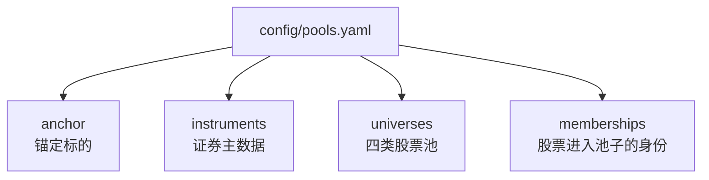
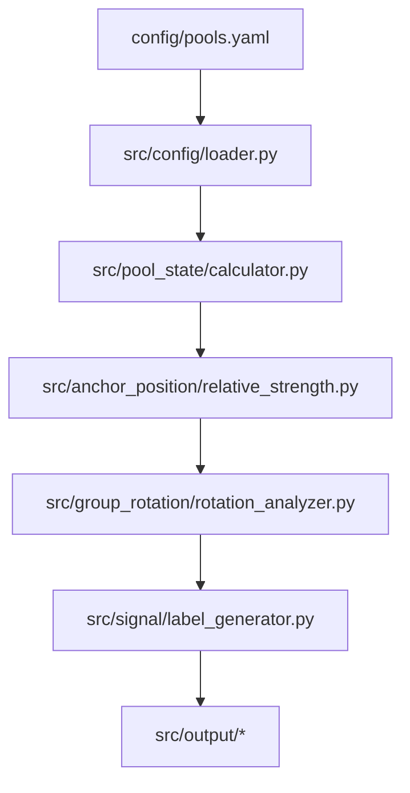
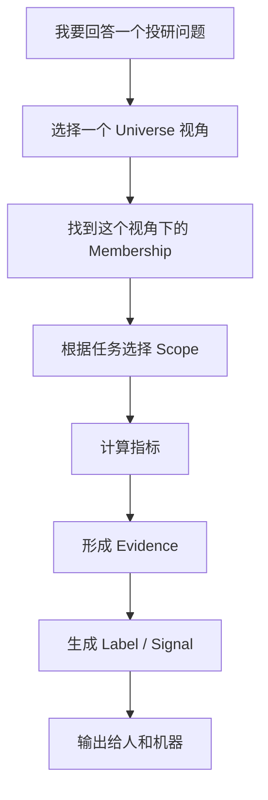

# AnchorLink 学习与查看指南

> 这份文档不是需求文档，也不是代码实现文档。
> 它的目标是帮你建立一条学习路径：怎么从外部产品思路理解这些概念，怎么在本项目里看配置、看页面、看输出、看代码。

---

## 0. 先记住这一句话

AnchorLink 做的事情可以先粗暴理解为：

```text
我盯着一只核心股票，看它今天是自己强/弱，还是它所在的业务同类、产业链、主题情绪、交易资金一起强/弱。
```

所以它不是一个普通股票池工具，也不是完整投研系统。它是一个“锚定标的行业位置判断工具”。

---

## 1. 外部系统一般怎么做类似事情

外部产品或投研系统里，类似 AnchorLink 的东西通常不会叫 AnchorLink，但会拆成这些概念：

| 外部常见概念 | 在 AnchorLink 里的名字 | 你可以怎么理解 |
| --- | --- | --- |
| Watchlist | Universe / Membership | 我关心的一组股票 |
| Peer Group | `direct_peers` | 真正业务可比公司 |
| Supply Chain / Industry Chain | `industry_chain` | 上下游和需求传导 |
| Theme Basket | `theme_pool` | 主题、概念、情绪热度 |
| Trading Watchlist | `trading_watchlist` | 短期资金异动观察 |
| Benchmark | `benchmark_scope` | 公平对照组 |
| Relative Strength | `relative_strength` | 锚定标的相对池子跑赢/跑输多少 |
| Market Breadth | `up_ratio` / 广度 | 池子里上涨股票占比 |
| Sector Rotation | `group_rotation` | 不同池子之间谁更强 |
| Signal / Evidence | `signals.evidence` | 标签和证据 |

你去外部学习时，不一定要搜 AnchorLink。更应该搜这些关键词：

```text
peer group analysis
relative strength analysis
sector rotation
market breadth
watchlist vs benchmark
stock universe
theme basket
industry chain analysis
```

中文关键词：

```text
同类公司比较
相对强弱
板块轮动
市场宽度 / 上涨家数占比
股票池管理
主题投资篮子
产业链跟踪
```

---

## 2. 项目里到底从哪里开始看

不要一开始就看代码。推荐顺序：

```text
1. 先看前端页面，看系统展示什么
2. 再看配置文件，看股票池怎么配
3. 再看输出文件，看机器最终拿到什么
4. 最后看代码，看它怎么计算
```

项目内最重要的入口：

| 你想看什么 | 去哪里看 |
| --- | --- |
| 可视化页面 | `http://localhost:3000` |
| 股票池配置页面 | `http://localhost:3000/pools` |
| 核心配置文件 | `config/pools.yaml` |
| 机器输出 JSON | `data/output/{date}/industry_snapshot.json` |
| 人工检查矩阵 | `data/output/{date}/peer_matrix.csv` |
| 人类可读报告 | `data/output/{date}/industry_report.md` |
| 可视化理解图 | `docs/核心逻辑.md` §13 可视化参考 |
| 核心逻辑说明 | `docs/核心逻辑.md` |

---

## 3. 看前端页面时怎么看

启动前端：

```bash
cd web
npm run dev
```

打开：

```text
http://localhost:3000
```

### 3.1 `/pools` 页面

这是最适合先看的页面。

你在这里看三件事：

1. Anchor 是谁。
2. 四类 Universe 分别是什么。
3. 每只股票在每个 Universe 里是什么身份。

重点看这些列：

| 列 | 含义 |
| --- | --- |
| `Universe ID` | 股票属于哪个池子 |
| `Role` | 它在这个池子里扮演什么角色 |
| `enabled` | 是否启用 |
| `benchmark` | 是否参与基准 |
| `ranking` | 是否参与排名 |
| `report` | 是否参与展示 |
| `relevance` | 相关度 |

你会看到一个关键现象：

```text
theme_pool 和 trading_watchlist 的 benchmark 是关闭的。
```

这不是问题。问题是当前代码误把“不开 benchmark”理解成了“不计算状态”。这就是我们后面要修的核心。

### 3.2 `/` 仪表盘页面

这里看系统最终想回答什么：

- 池子强弱对比
- 组间轮动
- 信号标签
- 结构化结论
- peer matrix 表格

如果你看到主题池、交易观察池没有状态，不要先怀疑配置。要记住：

```text
配置里有这些池子；当前代码计算口径还没修完。
```

### 3.3 `/layers/*` 页面

这些页面适合第二轮学习时看。

| 页面 | 看什么 |
| --- | --- |
| `/layers/pool-state` | 每个池子的状态 |
| `/layers/anchor-position` | Anchor 相对每个池子的位置 |
| `/layers/group-rotation` | 池子之间谁强谁弱 |
| `/layers/signals` | 结论标签和证据 |
| `/layers/conclusion` | 最终结构化结论 |

---

## 4. 看配置文件时怎么看

核心配置文件：

```text
config/pools.yaml
```

它不是普通列表，而是四层结构：



### 4.1 anchor

看当前分析围绕谁。

```yaml
anchor:
  symbol: 688333.SH
  name: 铂力特
```

### 4.2 instruments

看股票本身是什么。

它只维护事实，不维护分析结论。

```yaml
- symbol: 688433.SH
  name: 华曙高科
  fact_tags: [增材制造, 3D打印设备, 工业级打印]
```

### 4.3 universes

看四类股票池分别回答什么问题。

```yaml
- universe_id: direct_peers
  display_name: 核心同类池
```

四类池：

| Universe | 它回答的问题 |
| --- | --- |
| `direct_peers` | 真正同类公司强不强 |
| `industry_chain` | 上下游有没有联动 |
| `theme_pool` | 主题热不热 |
| `trading_watchlist` | 短期资金有没有异动 |

### 4.4 memberships

这是最重要的地方。

Membership 表示：

```text
某只股票为什么进入某个池子，以及在这个池子里用来做什么。
```

示例：

```yaml
- universe_id: direct_peers
  symbol: 688433.SH
  role: direct_comparable
  relevance: 0.90
  include_in_benchmark: true
  include_in_ranking: true
  include_in_report: true
  reason: "同属增材制造赛道..."
```

要重点看：

| 字段 | 你应该怎么理解 |
| --- | --- |
| `universe_id` | 它在哪个问题视角里 |
| `symbol` | 哪只股票 |
| `role` | 它扮演什么角色 |
| `relevance` | 它和 Anchor / 主题有多相关 |
| `include_in_benchmark` | 是否作为公平对照组 |
| `include_in_ranking` | 是否参与 Anchor 排名 |
| `include_in_report` | 是否展示出来 |
| `reason` | 为什么它在这里 |

---

## 5. 看输出文件时怎么看

输出目录：

```text
data/output/{date}/
```

当前已有：

```text
data/output/20260430/
```

### 5.1 industry_snapshot.json

这是给机器读的最终结果。

优先看这些字段：

| 字段 | 含义 |
| --- | --- |
| `anchor` | 锚定标的信息 |
| `industry_state` | 行业/池子状态摘要 |
| `anchor_position` | Anchor 相对位置 |
| `group_rotation` | 组间轮动 |
| `signals` | 带证据的标签 |
| `conclusion` | 最终结论 |

你要特别观察：

```text
theme_pool_return_median 是否为 null
core_vs_theme_spread 是否为 null
core_vs_trading_spread 是否为 null
```

如果是 `null`，就是当前口径问题的体现。

### 5.2 peer_matrix.csv

这是给人检查的。

每行不是“一只股票”，而是“一个 membership”。

也就是说：

```text
华曙高科可以出现两行：
一行是 direct_peers 的核心同类
一行是 theme_pool 的主题代理
```

看这个文件时，重点检查：

- 每个 membership 属于哪个 Universe。
- 每个 membership 的 role 是否合理。
- `include_in_benchmark` 是否符合产品语义。
- 当日行情数据是否存在。
- 排名字段是否可信。

当前已知问题：

```text
CSV 的非 Anchor 行排名可能不可信，因为当前实现把 Anchor 的排名套给了成员行。
```

### 5.3 industry_report.md

这是给人读的每日报告。

它应该回答：

- 核心同类强不强？
- 产业链强不强？
- 主题热不热？
- 交易观察池有没有升温？
- Anchor 跑赢还是跑输？
- 有什么证据？

当前你会看到：

```text
主题扩散 | - | - | - | 0/5
交易观察 | - | - | - | 0/6
```

这不是最终目标，而是当前实现差距。

---

## 6. 看代码时怎么看

代码不要一上来全看。按数据流看：



### 6.1 src/config/loader.py

看配置怎么变成代码对象。

重点理解：

- `Instrument`
- `Universe`
- `Membership`
- `PoolRegistry`
- `get_benchmark_scope`
- `get_ranking_scope`
- `get_report_scope`

未来要加：

- `get_state_scope`
- `get_rotation_scope`

### 6.2 src/pool_state/calculator.py

看每个池子状态怎么计算。

当前关键问题就在这里：

```text
PoolStateCalculator 当前使用 get_benchmark_scope()
```

目标应该是：

```text
PoolStateCalculator 使用 get_state_scope()
```

### 6.3 src/group_rotation/rotation_analyzer.py

看池子之间怎么比较强弱。

当前问题：

```text
它会过滤 can_be_benchmark=false 的池子。
```

目标应该是：

```text
只要池子有有效 PoolState，就可以参与组间轮动。
```

### 6.4 src/output/*

看最终怎么输出。

重点看：

- `json_writer.py`
- `csv_writer.py`
- `report_generator.py`

当前要改的方向：

- JSON 输出完整四类池状态。
- CSV 不要把 Anchor 排名套给所有成员。
- Markdown 报告展示四类池状态。

---

## 7. 最推荐的学习顺序

### 第一遍：只建立直觉

用 20 分钟：

```text
1. 打开 http://localhost:3000/pools
2. 看四个池子分别有哪些股票
3. 看 benchmark / ranking / report 三列
4. 打开 docs/核心逻辑.md，看 §13 可视化参考
5. 看前 5 节图
```

这时不要看代码。

### 第二遍：理解配置

用 30 分钟：

```text
1. 打开 config/pools.yaml
2. 找到 anchor
3. 找到 universes
4. 找到 memberships
5. 对照 /pools 页面看
```

目标是理解：

```text
股票池不是一个列表，而是很多 membership。
```

### 第三遍：理解输出

用 30 分钟：

```text
1. 打开 data/output/20260430/industry_snapshot.json
2. 找 industry_state
3. 找 anchor_position
4. 找 group_rotation
5. 找 signals
6. 打开 industry_report.md 对照文字结论
```

目标是理解：

```text
系统最终不是为了展示配置，而是为了生成结论。
```

### 第四遍：理解代码差距

用 40 分钟：

```text
1. 看 src/config/loader.py
2. 看 src/pool_state/calculator.py
3. 看 src/group_rotation/rotation_analyzer.py
4. 对照 docs/核心逻辑.md 第 8-11 节
```

目标是理解：

```text
当前代码哪里实现了，哪里还没对齐目标逻辑。
```

---

## 8. 你可以用这几个问题自测

如果能回答这些问题，就说明基本理解了。

1. Anchor 和 Universe 有什么区别？
2. Instrument 和 Membership 有什么区别？
3. 为什么华曙高科可以同时在 `direct_peers` 和 `theme_pool`？
4. Benchmark 是什么意思？
5. 为什么 `theme_pool` 不当 Benchmark，但仍然要计算状态？
6. `include_in_benchmark=false` 和“这个股票没用”是不是一回事？
7. 为什么当前报告里 theme/trading 是空？
8. 下一步为什么要加 `state_scope`？
9. `peer_matrix.csv` 为什么一只股票可以出现多行？
10. `industry_snapshot.json` 是给人看的，还是给机器看的？

---

## 9. 当前项目状态，用人话总结

现在已经有：

- 股票池资产配置：有。
- 四类 Universe：有。
- Membership 身份和 reason：有。
- 后端每日分析流程：能跑。
- JSON / CSV / Markdown 输出：有。
- 前端可视化页面：有。

但还没完全正确的是：

- `theme_pool` 和 `trading_watchlist` 没有真正参与 PoolState。
- GroupRotation 还没有比较四类池子。
- JSON 输出结构还不够完整。
- CSV 排名字段还需要修。

所以当前阶段可以定义为：

```text
MVP 骨架已经搭起来了。
核心口径正在从“benchmark 驱动”修正为“state / benchmark / ranking / report / rotation 分离”。
```

---

## 10. 最终要形成的心智模型



一句话：

```text
Universe 是问题视角。
Membership 是股票身份。
Scope 是计算口径。
Evidence 是结论证据。
Output 是系统协议。
```

这几个词分清楚，AnchorLink 的逻辑就会清楚很多。

